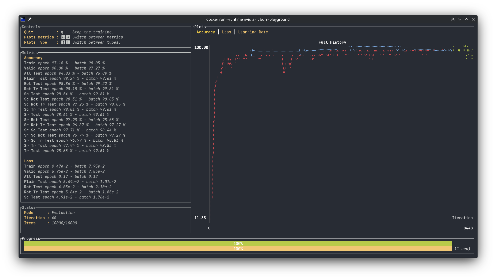

# Burn Playground

A Rust project for experimenting with the [burn](https://burn.dev) deep learning framework.

> **Note:** This code is adapted from burn's example repository. I've only tested it with CUDA. 

## Setup

```bash
# Clone the repository
git clone <repository-url>
cd burn-playground

# Build and run
cargo run
```

## Features

- MNIST training of a simple convolutional neural network ([from burn's repo](https://github.com/tracel-ai/burn/tree/main/examples/mnist))
- Docker image



## Usage

Run the application using the provided Docker image with CUDA support:

```bash
# Build the Docker image
docker build -t burn-playground .

# Run with NVIDIA GPU support
docker run --runtime nvidia -it burn-playground
```
